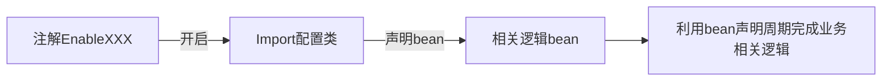

# 阅读收获
-  👍🏻掌握@Import使用技巧及加载原理
-  👍动手自定义@EnableXXX注解

# 本章节源码下载

[本章节源码已分享github](https://github.com/liangjianweiLJW/java-guide/tree/master/enbalexxx-spring-boot)

# 前言
开发中我们常常看到一些@EnableXXX开头的注解，如：@EnableScheduling，@EnableAsync，@EnableFeignClients，@EnableDiscoveryClient等等。那么我们也可以自定义一个这样的注解。

# @EnableXXX分析

点开@EnableScheduling注解查看：

```java
@Target({ElementType.TYPE})
@Retention(RetentionPolicy.RUNTIME)
@Import({SchedulingConfiguration.class})
@Documented
public @interface EnableScheduling {
}
```

该@EnableScheduling注解只是导入了一个配置类，点击查看SchedulingConfiguration

```java
@Configuration(
    proxyBeanMethods = false
)
@Role(2)
public class SchedulingConfiguration {
    public SchedulingConfiguration() {
    }

    @Bean(
        name = {"org.springframework.context.annotation.internalScheduledAnnotationProcessor"}
    )
    @Role(2)
    public ScheduledAnnotationBeanPostProcessor scheduledAnnotationProcessor() {
        return new ScheduledAnnotationBeanPostProcessor();
    }
}
```

声明了一个ScheduledAnnotationBeanPostProcessor后置处理器，点进去看看：

```java
public class ScheduledAnnotationBeanPostProcessor implements ScheduledTaskHolder, MergedBeanDefinitionPostProcessor, DestructionAwareBeanPostProcessor, Ordered, EmbeddedValueResolverAware, BeanNameAware, BeanFactoryAware, ApplicationContextAware, SmartInitializingSingleton, ApplicationListener<ContextRefreshedEvent>, DisposableBean {
    public static final String DEFAULT_TASK_SCHEDULER_BEAN_NAME = "taskScheduler";
    protected final Log logger = LogFactory.getLog(this.getClass());
    private final ScheduledTaskRegistrar registrar;
    @Nullable
    private Object scheduler;
    @Nullable
    private StringValueResolver embeddedValueResolver;
    @Nullable
    private String beanName;
    @Nullable
    private BeanFactory beanFactory;
    @Nullable
    private ApplicationContext applicationContext;
    private final Set<Class<?>> nonAnnotatedClasses = Collections.newSetFromMap(new ConcurrentHashMap(64));
    private final Map<Object, Set<ScheduledTask>> scheduledTasks = new IdentityHashMap(16);

    public ScheduledAnnotationBeanPostProcessor() {
        this.registrar = new ScheduledTaskRegistrar();
    }
```

这个后置处理器逻辑还是挺复杂的，看看继承的类和实现接口大概知道，利用bean声明周期相关回调方法，读取方法上的@scheduler信息做一些处理，这里不深究源码。




# 加载配置
## @Configuration

java config方式是是使用注解@Configuration声明一个配置文件，用@Bean声明一个bean，bean的id默认方法名；springboot开发常用的加载配置方式，该方式可以不用写xml，适合开发者的开发习惯。推荐

```java
@Configuration
public class BConfiguration {

    @Bean
    @ConditionalOnMissingBean
    public B b() {
        System.out.println("开始注入b");
        return new B();
    }
}
```

## @PropertySource

该注解能加载.properties文件到Spingboot环境中，如：

```java
@PropertySource(value = "classpath:user.properties", encoding ="UTF-8" )
```

user.properties

```properties
user.userName= root
user.isAdmin= true
user.regTime= 2022/01/01
user.isOnline= 1
user.maps.k1=v1
user.maps.k2=v2
user.lists=list1,list2
user.address.tel= 16800
user.address.name=哈哈
```

```JAVA
@Component
@ConfigurationProperties(prefix = "user")
public class User {

    private String userName;
    private boolean isAdmin;
    private Date regTime;
    private Long isOnline;
    private Map<String, Object> maps;
    private List<Object> lists;
    private Address address;

    @Override
    public String toString() {
        return "User{" +
                "userName='" + userName + ''' +
                ", isAdmin=" + isAdmin +
                ", regTime=" + regTime +
                ", isOnline=" + isOnline +
                ", maps=" + maps +
                ", lists=" + lists +
                ", address=" + address +
                '}';
    }

  //省略setter getter
   
}
```
```JAVA
public class Address {
    private String tel;
    private String name;

    @Override
    public String toString() {
        return "Address{" +
                "tel='" + tel + ''' +
                ", name='" + name + ''' +
                '}';
    }
  //省略setter getter
 
}
```
加入到环境就可以使用`@ConfigurationProperties`和`@Value`等注解获取到属性性。和在application.xml中配置的属性一样的道理，只是把属性放到一个.properties文件中

## @ImportResource
@ImportResource注解用于导入Spring的bean配置文件，让配置文件里面的内容生效；如：以前写的springmvc.xml和applicationContext.xml等文件。我们使用spingboot框架的话，可以使用java config方式配置，如果有xml配置文件，可以使用@ImportResource这个注解导入到springboot环境。
```java
@ImportResource(locations = "classpath:beans.xml")
```


```XML
<?xml version="1.0" encoding="UTF-8"?>
<beans xmlns="http://www.springframework.org/schema/beans"
       xmlns:xsi="http://www.w3.org/2001/XMLSchema-instance"
       xsi:schemaLocation="http://www.springframework.org/schema/beans http://www.springframework.org/schema/beans/spring-beans.xsd">
    <bean id="importSourceService" class="com.ljw.service.ImportSourceService">
        <!--        给这个初始化值-->
        <property name="name" value="ljw"/>
        <property name="age" value="18"/>
    </bean>

</beans>
```

```JAVA
public class ImportSourceService {

    private String name;
    private int age;

    public String getName() {
        return name;
    }

    public void setName(String name) {
        this.name = name;
    }

    public int getAge() {
        return age;
    }

    public void setAge(int age) {
        this.age = age;
    }

    @Override
    public String toString() {
        return "ImportSourceService{" +
                "name='" + name + ''' +
                ", age=" + age +
                '}';
    }
}
```

## @Import
注解@Import可以导入配置到springboot环境中，它支持多种方式把bean导入到ioc容器中：
- 普通类
- @Configuration的配置类
- ImportSelector的实现类
- ImportBeanDefinitionRegistrar的实现类

4.2 版本之前只可以导入配置类，4.2版本之后也可以导入普通类，所以这四种方式其实就变成一种，就是所有类都用该注解导入到环境中。只是每种方式bean生命周期逻辑不一样而已。

下面就这四种方式进行验证

### 1.普通类
```java
/**
 * @Description: 普通服务类-直接import注入：@Import(A.class)
 * @Author: jianweil
 * @date: 2021/12/31 11:50
 */
public class A {

    public A() {
        System.out.println("======A实例化======");
    }

}
```

### 2.@Configuration的配置类

使用注解@Configuration声明该类为配置类
```java
@Configuration
public class BConfiguration {

    @Bean
    @ConditionalOnMissingBean
    public B b() {
        System.out.println("开始注入b");
        return new B();
    }
}
```
```java
/**
 * @Description: @Configuration注入
 * @Author: jianweil
 * @date: 2021/12/31 11:50
 */
public class B implements InitializingBean {
    public B() {
        System.out.println("======B实例化======");
    }

    @Override
    public void afterPropertiesSet() throws Exception {
        System.out.println("执行B的业务方法");
    }
}
```

### 3.ImportSelector的实现

实现ImportSelector接口，并重写selectImports方法，把com.ljw.service.C注入到ioc容器
```java
public class ImportSelectorImpl implements ImportSelector {

    @Override
    public String[] selectImports(AnnotationMetadata importingClassMetadata) {

        return new String[]{C.class.getName()};
        //return new String[]{"com.ljw.service.C"};
    }

    @Override
    public Predicate<String> getExclusionFilter() {
        return ImportSelector.super.getExclusionFilter();
    }
}
```

### 4.ImportBeanDefinitionRegistrar的实现
**实现ImportBeanDefinitionRegistrar接口，并获取我们自定义的注解EnableDefinedBean的参数isBeanNon动态判断是否注入Non.class类**

```java
public class ImportBeanDefinitionRegistrarImpl implements ImportBeanDefinitionRegistrar {
    @Override
    public void registerBeanDefinitions(AnnotationMetadata importingClassMetadata, BeanDefinitionRegistry registry) {
        //在这里可以拿到所有注解的信息，可以根据不同注解的和注解的属性来返回不同的class,从而达到开启不同功能的目的
        AnnotationAttributes annotationAttributes = AnnotationAttributes.fromMap(
                importingClassMetadata.getAnnotationAttributes(
                        EnableDefinedBean.class.getName()));

        //根据注解配置参数值是否注入Non.class
        boolean isBeanNon = annotationAttributes.getBoolean("isBeanNon");
        if (isBeanNon) {
            Class nonbeanClass = Non.class;
            RootBeanDefinition nonbeanDefinition = new RootBeanDefinition(nonbeanClass);
            String beanName = StringUtils.uncapitalize(nonbeanClass.getSimpleName());
            registry.registerBeanDefinition(beanName, nonbeanDefinition);
        }
        //默认注入D.class
        Class beanClass = D.class;
        RootBeanDefinition beanDefinition = new RootBeanDefinition(beanClass);
        String beanName = StringUtils.uncapitalize(beanClass.getSimpleName());
        //在这里可以拿到所有注解的信息，可以根据不同注解来返回不同的class,从而达到开启不同功能的目的
        //通过这种方式可以自定义beanName
        registry.registerBeanDefinition(beanName, beanDefinition);
    }
}
```

## 自定义注解@EnableDefinedBean
```JAVA
@Target(ElementType.TYPE)
@Retention(RetentionPolicy.RUNTIME)
//导入属性配置文件
@PropertySource(value = "classpath:user.properties", encoding ="UTF-8" )
//导入一个bean定义资源
@ImportResource(locations = "classpath:beans.xml")
//导入一些bean类
@Import({A.class, ImportSelectorImpl.class, ImportBeanDefinitionRegistrarImpl.class})
public @interface EnableDefinedBean {

    boolean isBeanNon() default false;
}
```
- 使用@PropertySource导入属性文件user.properties
- 使用@ImportResource导入beans配置文件beans.xml
- 使用@Import导入普通类A.class
- 使用@Import导入实现ImportSelector接口类ImportSelectorImpl.class
- 使用@Import导入实现ImportBeanDefinitionRegistrar接口类ImportBeanDefinitionRegistrarImpl.class


## 测试类
下面测试可以看出上面的注解都发挥了他的作用，并且可以通过自定义注解的参数动态控制bean是否注入的逻辑。

```java
@SpringBootApplication
//开启注入Non.class
@EnableDefinedBean(isBeanNon = true)
//@EnableDefinedBean
public class App {
    public static void main(String[] args) {
        ConfigurableApplicationContext context = SpringApplication.run(App.class, args);
        System.out.println("-->" + context.getBean(A.class));
        System.out.println("-->" + context.getBean(B.class));
        System.out.println("-->" + context.getBean(C.class));
        System.out.println("-->" + context.getBean(D.class));
        System.out.println("-->" + context.getBean(ImportSourceService.class));
        System.out.println("-->" + context.getBean(User.class));

        try {
            Non bean = context.getBean(Non.class);
            System.out.println("-->" + bean);
        } catch (BeansException e) {
            System.err.println("-->没有注入Non");

        }

    }
}
```
自定义注解配置true参数运行结果：@EnableDefinedBean(isBeanNon = true)
```console
开始注入b
======B实例化======
执行B的业务方法
======A实例化======
======C实例化======
======D实例化======
2021-12-31 16:36:43.350  INFO 13152 --- [           main] com.ljw.App                              : Started App in 0.758 seconds (JVM running for 1.383)
-->com.ljw.service.A@52066604
-->com.ljw.service.B@340b9973
-->com.ljw.service.C@56113384
-->com.ljw.service.D@5669c5fb
-->ImportSourceService{name='ljw', age=18}
-->User{userName='root', isAdmin=false, regTime=Sat Jan 01 00:00:00 CST 2022, isOnline=1, maps={k2=v2, k1=v1}, lists=[list1, list2], address=Address{tel='16800', name='哈哈'}}
-->com.ljw.service.Non@373ebf74

Process finished with exit code 0

```

自定义注解默认参数运行结果：@EnableDefinedBean
```console
开始注入b
======B实例化======
执行B的业务方法
======A实例化======
======C实例化======
======D实例化======
2021-12-31 16:37:34.041  INFO 83928 --- [           main] com.ljw.App                              : Started App in 0.71 seconds (JVM running for 1.309)
-->com.ljw.service.A@5f9678e1
-->com.ljw.service.B@c4ed84
-->com.ljw.service.C@189aa67a
-->com.ljw.service.D@5a9d6f02
-->ImportSourceService{name='ljw', age=18}
-->User{userName='root', isAdmin=false, regTime=Sat Jan 01 00:00:00 CST 2022, isOnline=1, maps={k2=v2, k1=v1}, lists=[list1, list2], address=Address{tel='16800', name='哈哈'}}
-->没有注入Non
```

# 源码查看
下面查看源码springboot版本为2.6.1；由于spring流程比较复杂，我们直接查看关键信息：

## ConfigurationClassPostProcessor#processConfigBeanDefinitions

```java
public void processConfigBeanDefinitions(BeanDefinitionRegistry registry) {
    List<BeanDefinitionHolder> configCandidates = new ArrayList();
    String[] candidateNames = registry.getBeanDefinitionNames();
    String[] var4 = candidateNames;
    int var5 = candidateNames.length;

    for(int var6 = 0; var6 < var5; ++var6) {
        String beanName = var4[var6];
        BeanDefinition beanDef = registry.getBeanDefinition(beanName);
        if (beanDef.getAttribute(ConfigurationClassUtils.CONFIGURATION_CLASS_ATTRIBUTE) != null) {
            if (this.logger.isDebugEnabled()) {
                this.logger.debug("Bean definition has already been processed as a configuration class: " + beanDef);
            }
        } 
        //查看是否是配置类
        else if (ConfigurationClassUtils.checkConfigurationClassCandidate(beanDef, this.metadataReaderFactory)) {
            configCandidates.add(new BeanDefinitionHolder(beanDef, beanName));
        }
    }
    //对这些配置类根据Order排序
    if (!configCandidates.isEmpty()) {
        configCandidates.sort((bd1, bd2) -> {
            int i1 = ConfigurationClassUtils.getOrder(bd1.getBeanDefinition());
            int i2 = ConfigurationClassUtils.getOrder(bd2.getBeanDefinition());
            return Integer.compare(i1, i2);
        });
        SingletonBeanRegistry sbr = null;
        if (registry instanceof SingletonBeanRegistry) {
            sbr = (SingletonBeanRegistry)registry;
            if (!this.localBeanNameGeneratorSet) {
                BeanNameGenerator generator = (BeanNameGenerator)sbr.getSingleton("org.springframework.context.annotation.internalConfigurationBeanNameGenerator");
                if (generator != null) {
                    this.componentScanBeanNameGenerator = generator;
                    this.importBeanNameGenerator = generator;
                }
            }
        }

        if (this.environment == null) {
            this.environment = new StandardEnvironment();
        }
        //创建配置类的解析类
        ConfigurationClassParser parser = new ConfigurationClassParser(this.metadataReaderFactory, this.problemReporter, this.environment, this.resourceLoader, this.componentScanBeanNameGenerator, registry);
        Set<BeanDefinitionHolder> candidates = new LinkedHashSet(configCandidates);
        HashSet alreadyParsed = new HashSet(configCandidates.size());

        do {
            StartupStep processConfig = this.applicationStartup.start("spring.context.config-classes.parse");
            //ConfigurationClassParser#parse方法进行解析，重点,点进去查看
            parser.parse(candidates);
            parser.validate();
            Set<ConfigurationClass> configClasses = new LinkedHashSet(parser.getConfigurationClasses());
            configClasses.removeAll(alreadyParsed);
            if (this.reader == null) {
                this.reader = new ConfigurationClassBeanDefinitionReader(registry, this.sourceExtractor, this.resourceLoader, this.environment, this.importBeanNameGenerator, parser.getImportRegistry());
            }

            this.reader.loadBeanDefinitions(configClasses);
            alreadyParsed.addAll(configClasses);
            processConfig.tag("classCount", () -> {
                return String.valueOf(configClasses.size());
            }).end();
            candidates.clear();
            if (registry.getBeanDefinitionCount() > candidateNames.length) {
                String[] newCandidateNames = registry.getBeanDefinitionNames();
                Set<String> oldCandidateNames = new HashSet(Arrays.asList(candidateNames));
                Set<String> alreadyParsedClasses = new HashSet();
                Iterator var13 = alreadyParsed.iterator();

                while(var13.hasNext()) {
                    ConfigurationClass configurationClass = (ConfigurationClass)var13.next();
                    alreadyParsedClasses.add(configurationClass.getMetadata().getClassName());
                }

                String[] var24 = newCandidateNames;
                int var25 = newCandidateNames.length;

                for(int var15 = 0; var15 < var25; ++var15) {
                    String candidateName = var24[var15];
                    if (!oldCandidateNames.contains(candidateName)) {
                        BeanDefinition bd = registry.getBeanDefinition(candidateName);
                        if (ConfigurationClassUtils.checkConfigurationClassCandidate(bd, this.metadataReaderFactory) && !alreadyParsedClasses.contains(bd.getBeanClassName())) {
                            candidates.add(new BeanDefinitionHolder(bd, candidateName));
                        }
                    }
                }

                candidateNames = newCandidateNames;
            }
        } while(!candidates.isEmpty());

        if (sbr != null && !sbr.containsSingleton(IMPORT_REGISTRY_BEAN_NAME)) {
            sbr.registerSingleton(IMPORT_REGISTRY_BEAN_NAME, parser.getImportRegistry());
        }

        if (this.metadataReaderFactory instanceof CachingMetadataReaderFactory) {
            ((CachingMetadataReaderFactory)this.metadataReaderFactory).clearCache();
        }

    }
}
```

## ConfigurationClassParser#parse

```java
public void parse(Set<BeanDefinitionHolder> configCandidates) {
    Iterator var2 = configCandidates.iterator();

    while(var2.hasNext()) {
        BeanDefinitionHolder holder = (BeanDefinitionHolder)var2.next();
        BeanDefinition bd = holder.getBeanDefinition();

        try {
            if (bd instanceof AnnotatedBeanDefinition) {
                //属于AnnotatedBeanDefinition 方法1
                this.parse(((AnnotatedBeanDefinition)bd).getMetadata(), holder.getBeanName());
            } else if (bd instanceof AbstractBeanDefinition && ((AbstractBeanDefinition)bd).hasBeanClass()) {
                 //属于AbstractBeanDefinition方法2
                this.parse(((AbstractBeanDefinition)bd).getBeanClass(), holder.getBeanName());
            } else {
                 //其他方法3
                this.parse(bd.getBeanClassName(), holder.getBeanName());
            }
        } catch (BeanDefinitionStoreException var6) {
            throw var6;
        } catch (Throwable var7) {
            throw new BeanDefinitionStoreException("Failed to parse configuration class [" + bd.getBeanClassName() + "]", var7);
        }
    }

    this.deferredImportSelectorHandler.process();
}

//方法3
protected final void parse(@Nullable String className, String beanName) throws IOException {
    Assert.notNull(className, "No bean class name for configuration class bean definition");
    MetadataReader reader = this.metadataReaderFactory.getMetadataReader(className);
    this.processConfigurationClass(new ConfigurationClass(reader, beanName), DEFAULT_EXCLUSION_FILTER);
}
//方法2
protected final void parse(Class<?> clazz, String beanName) throws IOException {
    this.processConfigurationClass(new ConfigurationClass(clazz, beanName), DEFAULT_EXCLUSION_FILTER);
}
//方法1
protected final void parse(AnnotationMetadata metadata, String beanName) throws IOException {
    this.processConfigurationClass(new ConfigurationClass(metadata, beanName), DEFAULT_EXCLUSION_FILTER);
}
```
三种不同的类信息都是通过processConfigurationClass解析。

## ConfigurationClassParser#processConfigurationClass

```java
protected void processConfigurationClass(ConfigurationClass configClass, Predicate<String> filter) throws IOException {
    if (!this.conditionEvaluator.shouldSkip(configClass.getMetadata(), ConfigurationPhase.PARSE_CONFIGURATION)) {
        ConfigurationClass existingClass = (ConfigurationClass)this.configurationClasses.get(configClass);
        
        //在这里处理Configuration重复import；如果同一个配置类被处理两次，两次都属于被import的则合并导入类，返回。如果配置类不是被导入的，则移除旧使用新的配置类
        if (existingClass != null) {
            if (configClass.isImported()) {
                if (existingClass.isImported()) {
                    existingClass.mergeImportedBy(configClass);
                }

                return;
            }

            this.configurationClasses.remove(configClass);
            this.knownSuperclasses.values().removeIf(configClass::equals);
        }

        ConfigurationClassParser.SourceClass sourceClass = this.asSourceClass(configClass, filter);

        do {
        //进入看看
            sourceClass = this.doProcessConfigurationClass(configClass, sourceClass, filter);
        } while(sourceClass != null);

        this.configurationClasses.put(configClass, configClass);
    }
}
```


## ConfigurationClassParser#doProcessConfigurationClass
`@Bean`、`@ImportResource` 、`@Import`、`@ComponentScan`、`@PropertySource`都是这个方法处理

```java
@Nullable
protected final ConfigurationClassParser.SourceClass doProcessConfigurationClass(ConfigurationClass configClass, ConfigurationClassParser.SourceClass sourceClass, Predicate<String> filter) throws IOException {
    // 处理递归类
    if (configClass.getMetadata().isAnnotated(Component.class.getName())) {
        this.processMemberClasses(configClass, sourceClass, filter);
    }

// 处理@PropertySource注解
    Iterator var4 = AnnotationConfigUtils.attributesForRepeatable(sourceClass.getMetadata(), PropertySources.class, PropertySource.class).iterator();

    AnnotationAttributes importResource;
    while(var4.hasNext()) {
        importResource = (AnnotationAttributes)var4.next();
        if (this.environment instanceof ConfigurableEnvironment) {
            this.processPropertySource(importResource);
        } else {
            this.logger.info("Ignoring @PropertySource annotation on [" + sourceClass.getMetadata().getClassName() + "]. Reason: Environment must implement ConfigurableEnvironment");
        }
    }
    // 处理 @ComponentScan 注解
    Set<AnnotationAttributes> componentScans = AnnotationConfigUtils.attributesForRepeatable(sourceClass.getMetadata(), ComponentScans.class, ComponentScan.class);
    if (!componentScans.isEmpty() && !this.conditionEvaluator.shouldSkip(sourceClass.getMetadata(), ConfigurationPhase.REGISTER_BEAN)) {
        Iterator var14 = componentScans.iterator();

        while(var14.hasNext()) {
            AnnotationAttributes componentScan = (AnnotationAttributes)var14.next();
            Set<BeanDefinitionHolder> scannedBeanDefinitions = this.componentScanParser.parse(componentScan, sourceClass.getMetadata().getClassName());
            Iterator var8 = scannedBeanDefinitions.iterator();

            while(var8.hasNext()) {
                BeanDefinitionHolder holder = (BeanDefinitionHolder)var8.next();
                BeanDefinition bdCand = holder.getBeanDefinition().getOriginatingBeanDefinition();
                if (bdCand == null) {
                    bdCand = holder.getBeanDefinition();
                }

                if (ConfigurationClassUtils.checkConfigurationClassCandidate(bdCand, this.metadataReaderFactory)) {
                    this.parse(bdCand.getBeanClassName(), holder.getBeanName());
                }
            }
        }
    }

   //处理Import注解
    this.processImports(configClass, sourceClass, this.getImports(sourceClass), filter, true);
    // 处理@ImportResource 注解
    importResource = AnnotationConfigUtils.attributesFor(sourceClass.getMetadata(), ImportResource.class);
    if (importResource != null) {
        String[] resources = importResource.getStringArray("locations");
        Class<? extends BeanDefinitionReader> readerClass = importResource.getClass("reader");
        String[] var20 = resources;
        int var22 = resources.length;

        for(int var23 = 0; var23 < var22; ++var23) {
            String resource = var20[var23];
            String resolvedResource = this.environment.resolveRequiredPlaceholders(resource);
            configClass.addImportedResource(resolvedResource, readerClass);
        }
    }

  //处理包含@Bean注解的方法
    Set<MethodMetadata> beanMethods = this.retrieveBeanMethodMetadata(sourceClass);
    Iterator var18 = beanMethods.iterator();

    while(var18.hasNext()) {
        MethodMetadata methodMetadata = (MethodMetadata)var18.next();
        configClass.addBeanMethod(new BeanMethod(methodMetadata, configClass));
    }
  // 处理普通方法
    this.processInterfaces(configClass, sourceClass);
    if (sourceClass.getMetadata().hasSuperClass()) {
        String superclass = sourceClass.getMetadata().getSuperClassName();
        if (superclass != null && !superclass.startsWith("java") && !this.knownSuperclasses.containsKey(superclass)) {
            this.knownSuperclasses.put(superclass, configClass);
            return sourceClass.getSuperClass();
        }
    }

    return null;
}
```

##  ConfigurationClassParser#processImports

这里点进去查看@Import解析方法

```java

private void processImports(ConfigurationClass configClass, ConfigurationClassParser.SourceClass currentSourceClass, Collection<ConfigurationClassParser.SourceClass> importCandidates, Predicate<String> exclusionFilter, boolean checkForCircularImports) {
    if (!importCandidates.isEmpty()) {
        if (checkForCircularImports && this.isChainedImportOnStack(configClass)) {
            this.problemReporter.error(new ConfigurationClassParser.CircularImportProblem(configClass, this.importStack));
        } else {
            this.importStack.push(configClass);

            try {
                Iterator var6 = importCandidates.iterator();

                while(var6.hasNext()) {
                    ConfigurationClassParser.SourceClass candidate = (ConfigurationClassParser.SourceClass)var6.next();
                    Class candidateClass;
                    
                    //如果实现了ImportSelector接口
                    if (candidate.isAssignable(ImportSelector.class)) {
                        candidateClass = candidate.loadClass();
                        ImportSelector selector = (ImportSelector)ParserStrategyUtils.instantiateClass(candidateClass, ImportSelector.class, this.environment, this.resourceLoader, this.registry);
                        Predicate<String> selectorFilter = selector.getExclusionFilter();
                        if (selectorFilter != null) {
                            exclusionFilter = exclusionFilter.or(selectorFilter);
                        }

                        if (selector instanceof DeferredImportSelector) {
                            this.deferredImportSelectorHandler.handle(configClass, (DeferredImportSelector)selector);
                        } else {
                            String[] importClassNames = selector.selectImports(currentSourceClass.getMetadata());
                            Collection<ConfigurationClassParser.SourceClass> importSourceClasses = this.asSourceClasses(importClassNames, exclusionFilter);
                            this.processImports(configClass, currentSourceClass, importSourceClasses, exclusionFilter, false);
                        }
                    } 
                    //如果实现了ImportBeanDefinitionRegistrar接口
                    else if (candidate.isAssignable(ImportBeanDefinitionRegistrar.class)) {
                        candidateClass = candidate.loadClass();
                        ImportBeanDefinitionRegistrar registrar = (ImportBeanDefinitionRegistrar)ParserStrategyUtils.instantiateClass(candidateClass, ImportBeanDefinitionRegistrar.class, this.environment, this.resourceLoader, this.registry);
                        configClass.addImportBeanDefinitionRegistrar(registrar, currentSourceClass.getMetadata());
                    } else {
                       //将import当成Configuration来使用，就是我们的普通类方式导入
                        this.importStack.registerImport(currentSourceClass.getMetadata(), candidate.getMetadata().getClassName());
                        this.processConfigurationClass(candidate.asConfigClass(configClass), exclusionFilter);
                    }
                }
            } catch (BeanDefinitionStoreException var17) {
                throw var17;
            } catch (Throwable var18) {
                throw new BeanDefinitionStoreException("Failed to process import candidates for configuration class [" + configClass.getMetadata().getClassName() + "]", var18);
            } finally {
                this.importStack.pop();
            }
        }

    }
}
```

该方法解析了上面三种情况导入：
1. 实现了ImportSelector接口
2. 实现了ImportBeanDefinitionRegistrar接口
3. 普通类

- 👍🏻：有收获的，点赞鼓励！
- ❤️：收藏文章，方便回看！
- 💬：评论交流，互相进步！
