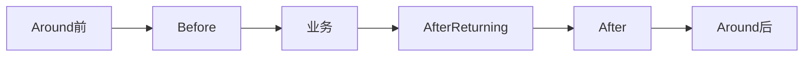

# 本章源码下载
[本章源码下载已分享github](url)
# AOP是什么

- AOP又叫`面向切面编程`，旨在通过允许横切关注点的分离，提高`模块化`。通俗理解就是，将那些与业务无关，却为业务模块所共同调用的逻辑代码封装起来，形成一个切面，使原来的业务功能更加强大，即`增强`，并`减少重复代码`，`降低`模块间的`耦合度`，方便后期操作和维护

# 静态代理和动态代理区别

- AOP实现的关键就在于AOP框架自动创建的AOP代理，AOP代理则可分为静态代理和动态代理两大类
    - `静态代理`是指使用AOP框架提供的命令进行编译，从而在编译阶段就可生成 AOP 代理类，因此也称为`编译时增强`
    - `动态代理`则在运行时借助于JDK动态代理、CGLIB等在内存中“临时”生成AOP动态代理类，因此也被称为`运行时增强`

# cglib和jdk动态代理

## cglib和jdk动态代理的区别？

- cglib动态代理：利用`ASM框架`，对代理对象类生成的class文件加载进来，通过修改其字节码生成`子类`来处理
    - 对指定的类生成一个子类，覆盖其中的方法，并覆盖其中方法的增强，但是因为采用的是继承，所以该类或方法最好不要生成final，对于final类或方法，是无法继承的
- JDK动态代理：利用拦截器（必须实现InvocationHandler）加上反射机制生成一个`代理接口`的匿名类，在调用具体方法前调用InvokeHandler来处理
    - jdk动态代理只能对实现了`接口`的类生成代理，而不能针对类


## cglib和jdk动态代理使用场景
- 目标对象生成了接口 默认用JDK动态代理
- 如果目标对象使用了接口，可以强制使用cglib(在spring配置中加入<aop:aspectj-autoproxy proxyt-target-class="true"/>)
- 如果目标对象没有实现接口，必须采用cglib库，Spring会`自动`在JDK动态代理和cglib之间`转换`

## cglib比jdk快
- cglib底层是ASM字节码生成框架，但是字节码技术生成代理类，在JDL1.6之前比使用java反射的效率要高
- 在jdk6之后逐步对JDK动态代理进行了优化，在调用次数比较少时效率高于cglib代理效率
- 只有在大量调用的时候cglib的效率高，但是在1.8的时候JDK的效率已高于cglib
- Cglib不能对声明final的方法进行代理，因为cglib是动态生成代理对象，final关键字修饰的类不可变只能被引用不能被修改

| 区别 | CGLIB |JDK动态代理 |
| --- | --- | --- |
|原理|`动态`生成一个要代理的`子类`，`子类重写`要代理的类的所有不是final的方法。在子类中采用方法拦截技术拦截所有的父类方法的调用，顺势织入横切逻辑，它比Java反射的jdk动态代理要`快`|JDK中的动态代理是通过反射类Proxy以及InvocationHandler回调接口实现的，但是JDK中所有要进行动态代理的类`必须`要实现一个`接口`，也就是说只能对该类所实现接口中定义的方法进行代理，这在实际编程中有一定的局限性，而且使用反射的效率`较慢` |
| 是否提供子类代理 | 是 |否 |
| 是否提供接口代理 | 是（可不用接口）  | 是（必须） |


## cglib实战
### 依赖

我这里直接在springboot项目测试了，spring-core带有cglib依赖
```xml
<dependency>
    <groupId>org.springframework.boot</groupId>
    <artifactId>spring-boot-starter</artifactId>
</dependency>
```

### 代码
要代理的方法say：
```java
/**
 * @Description: 将要被代理的类
 * @Author: jianweil
 * @date: 2021/12/7 15:17
 */
public class HelloWorld {
    public String say(boolean say) throws Exception {
        System.out.println("Hello Student");
        if (!say) {
            throw new Exception("回答错误！");
        }
        return "回答正确!";
    }
}
```
测试类：
```java
package com.ljw.springbootaop.proxy.cglib;

import lombok.extern.slf4j.Slf4j;
import org.springframework.cglib.proxy.Enhancer;
import org.springframework.cglib.proxy.MethodInterceptor;
import org.springframework.cglib.proxy.MethodProxy;

import java.lang.reflect.Method;

/**
 * @Description: 测试cglib
 * @Author: jianweil
 * @date: 2021/12/7 15:25
 */
@Slf4j
public class Enhancer2Test {

    /**
     * 前置通知
     */
    private static void before() {
        log.info("before method invoke...");
    }
    /**
     * 后置通知
     */
    private static void after() {
        log.info("after method invoke...");
    }
    /**
     * 异常通知
     */
    private static void exception() {
        log.info("exception method invoke...");
    }
    /**
     * 方法返回前通知
     */
    private static void beforeReturning() {
        log.info("beforeReturning method invoke...");
    }

    public static void main(String[] args) throws Exception {
        HelloWorld hello = new HelloWorld();
        //还有其他的回调方法，这里测试方法拦截器回调：MethodInterceptor
        HelloWorld proxyHW = (HelloWorld) Enhancer.create(hello.getClass(), new MethodInterceptor() {
            @Override
            public Object intercept(Object o, Method method, Object[] objects, MethodProxy methodProxy) throws Throwable {
                Object result = null;
                try {
                    //前置通知
                    before();
                    result = method.invoke(hello, objects);
                    //后置通知
                    after();
                } catch (Exception e) {
                    //异常通知
                    exception();
                } finally {
                    //方法返回前通知
                    beforeReturning();
                }

                return result;
            }
        });
        //String result = proxyHW.say(true);
        String result = proxyHW.say(false);
        System.out.println(result);
    }
}
```
- 使用Enhancer创建代理类
- 这里使用方法拦截器的回调：MethodInterceptor，还有其他的，大家有空研究
- 被代理类不能是最终类


### 测试
- String result = proxyHW.say(true)：

```js
15:57:01.758 [main] INFO com.ljw.springbootaop.proxy.cglib.Enhancer2Test - before method invoke...
Hello Student
15:57:01.760 [main] INFO com.ljw.springbootaop.proxy.cglib.Enhancer2Test - after method invoke...
15:57:01.760 [main] INFO com.ljw.springbootaop.proxy.cglib.Enhancer2Test - beforeReturning method invoke...
回答正确!
```
- String result = proxyHW.say(false)：
```js
Connected to the target VM, address: '127.0.0.1:53976', transport: 'socket'
15:55:42.136 [main] INFO com.ljw.springbootaop.proxy.cglib.Enhancer2Test - before method invoke...
Hello Student
15:55:42.139 [main] INFO com.ljw.springbootaop.proxy.cglib.Enhancer2Test - exception method invoke...
15:55:42.139 [main] INFO com.ljw.springbootaop.proxy.cglib.Enhancer2Test - beforeReturning method invoke...
null
```

## jdk动态代理实战
### 依赖

jdk环境就自带jdk动态代理需要的jar包。

### 代码
接口类：
```java
public interface Animal {
    void doWhat(boolean isDo) throws Exception;
}
```
实现类：
```java
public class Cat implements Animal {
    @Override
    public void doWhat(boolean isDo) throws Exception {
        if (!isDo) {
            System.out.println("Cat只会吃！");
            throw new Exception("Cat只会吃");
        } else {
            System.out.println("Cat会喵喵喵");
        }
    }
}
```
代理实现类：
```java
package com.ljw.springbootaop.proxy.jdk;

import lombok.extern.slf4j.Slf4j;

import java.lang.reflect.InvocationHandler;
import java.lang.reflect.Method;

/**
 * @Description: todo
 * @Author: jianweil
 * @date: 2021/12/7 16:06
 */
@Slf4j
public class AnimalInvacationHandler implements InvocationHandler {

    private final Animal animal;

    public AnimalInvacationHandler(Animal animal) {
        this.animal = animal;
    }

    /**
     * - proxy：就是代理对象，newProxyInstance方法的返回对象
     * - method：调用的方法
     * - args: 方法中的参数
     */
    @Override
    public Object invoke(Object proxy, Method method, Object[] args) throws Throwable {
        Object result = null;
        try {
            //前置通知
            before();
            result = method.invoke(animal, args);
            //后置通知
            after();
        } catch (Exception e) {
            //异常通知
            exception();
        } finally {
            //方法返回前通知
            beforeReturning();
        }

        return result;

    }


    private void before() {
        log.info("before method invoke...");
    }

    private void after() {
        log.info("after method invoke...");
    }

    private void exception() {
        log.info("exception method invoke...");
    }

    private void beforeReturning() {
        log.info("beforeReturning method invoke...");
    }
}
```
测试类：
```java
/**
 * @Description: 测试jdk动态代理
 * @Author: jianweil
 * @date: 2021/12/7 16:08
 */
public class InvacationHandlerTest {
    public static void main(String[] args) throws Exception {
        Animal cat = new Cat();
        /**
         * loader: 用哪个类加载器去加载代理对象
         * interfaces:动态代理类需要实现的接口
         * h:动态代理方法在执行时，会调用h里面的invoke方法去执行
         */
        Animal animal = (Animal) Proxy.newProxyInstance(cat.getClass().getClassLoader(), Cat.class.getInterfaces(), new AnimalInvacationHandler(cat));
        animal.doWhat(true);
        //animal.doWhat(false);
    }
}
```


### 测试
- animal.doWhat(true);

```js
16:28:04.105 [main] INFO com.ljw.springbootaop.proxy.jdk.AnimalInvacationHandler - before method invoke...
Cat会喵喵喵
16:28:04.107 [main] INFO com.ljw.springbootaop.proxy.jdk.AnimalInvacationHandler - after method invoke...
16:28:04.107 [main] INFO com.ljw.springbootaop.proxy.jdk.AnimalInvacationHandler - beforeReturning method invoke...
```
- animal.doWhat(false);
```js
16:28:36.455 [main] INFO com.ljw.springbootaop.proxy.jdk.AnimalInvacationHandler - before method invoke...
Cat只会吃！
16:28:36.457 [main] INFO com.ljw.springbootaop.proxy.jdk.AnimalInvacationHandler - exception method invoke...
16:28:36.457 [main] INFO com.ljw.springbootaop.proxy.jdk.AnimalInvacationHandler - beforeReturning method invoke...
```

# Spring AOP和Aspectj的区别

- Spring AOP
    - `Spring AOP是在运行期间通过代理生成目标类，属于动态代理。默认如果使用接口的，用JDK动态代理实现，如果没有接口则使用CGLIB实现`
    - Spring AOP致力于解决企业级开发中最普遍的AOP（方法织入），仅仅是`方法织入`
    - Spring AOP需要`依赖IOC容器`来管理，并且只能作用于Spring容器，使用纯Java代码实现
    - 在性能上，由于Spring AOP是基于动态代理来实现的，在容器启动时需要生成代理实例，在方法调用上也会增加栈的深度，使得Spring AOP的`性能较`AspectJ的`差`
    - Spring AOP`支持注解`，在使用@Aspect注解创建和配置切面时将更加方便。

- AspectJ
    - AspectJ是在编译期间将切面代码编译到目标代码的，属于静态代理，通过修改代码来实现，有如下几个织入的时机：
        - 编译期织入（Compile-time weaving）： 如类 A 使用 AspectJ 添加了一个属性，类 B 引用了它，这个场景就需要编译期的时候就进行织入，否则没法编译类 B。
        - 编译后织入（Post-compile weaving）： 也就是已经生成了 .class 文件，或已经打成 jar 包了，这种情况我们需要增强处理的话，就要用到编译后织入。
        - 类加载后织入（Load-time weaving）： 指的是在加载类的时候进行织入，要实现这个时期的织入，有几种常见的方法。
            - 1、自定义类加载器来干这个，这个应该是最容易想到的办法，在被织入类加载到 JVM 前去对它进行加载，这样就可以在加载的时候定义行为了。
            - 2、在 JVM 启动的时候指定 AspectJ 提供的 agent：`-javaagent:xxx/xxx/aspectjweaver.jar`。
    - AspectJ可以做Spring AOP干不了的事情，它是AOP编程的完全解决方案，AspectJ支持`所有切入点`，不仅仅是方法织入。
    - 因为AspectJ在实际运行之前就完成了织入，所以说它生成的类是`没有额外运行时开销`的
    - 需要通过.aj文件来创建切面，并且需要使用ajc（Aspect编译器）来编译代码。

| Spring AOP                 | AspectJ                                      |
| -------------------------- | -------------------------------------------- |
| 在纯 Java 中实现                | 使用 Java 编程语言的扩展实现                            |
| 不需要单独的编译过程                 | 除非设置 LTW，否则需要 AspectJ 编译器 (ajc)              |
| 只能使用`运行时`织入                  | 运行时织入不可用。支持`编译时、编译后和加载时`织入                     |
| 功能不强-仅支持`方法级`编织              | `更强大` - 可以编织字段、方法、构造函数、静态初始值设定项、最终类/方法等。 |
| 只能在由 Spring 容器管理的 bean 上实现 | 可以在所有域对象上实现                                  |
| 仅支持`方法`执行切入点                 | 支持`所有切入点`                                      |
| 代理是由目标对象创建的, 并且切面应用在这些代理上  | 在执行应用程序之前 (在运行时) 前, 各方面直接在代码中进行织入            |
| 比 AspectJ `慢`多了              | `更好`的性能                                        |
| 易于学习和应用                    | 相对于 Spring AOP 来说更复杂                         |


## 误区
- `曾经以为`AspectJ是Spring AOP一部分，是因为Spring AOP使用了AspectJ的Annotation。
    - 使用了Aspect来定义切面,使用Pointcut来定义切入点，使用Advice来定义增强处理。
- `Spring AOP虽然使用了Aspect的Annotation（@Aspect，@Pointcut，@Before等），但是并没有使用它的编译器和织入器。其实现原理是JDK动态代理和CGLIB，在运行时生成代理类。`
- 为了启用 Spring 对 @AspectJ 方面配置的支持，并保证 Spring 容器中的目标 Bean 被一个或多个方面自动增强，必须在 Spring 配置文件中添加如下配置：\<aop:aspectj-autoproxy/>，在高版本的springboot中已默认开启支持，并不需要配置。

# jdk动态代理，cglib，Spring AOP和Aspectj关系
- Spring AOP和Aspectj是两种实现aop的框架
- Spring AOP采用的是动态代理
    - 动态代理有两种底层技术实现：
        - jdk动态代理（默认有接口的目标类使用jdk动态代理）
        - cglib（没有接口或有接口的目标类使用）
    - Spring AOP采用了Aspectj包提供的注解，但是底层编译器和织入器并不是Aspectj
- Aspectj采用的是静态代理

# AOP相关概念
##  切面(Aspect)
- 切面是一个`横切关注点的模块化`，一个切面能够包含同一个类型的不同增强方法，比如说事务处理和日志处理可以理解为两个切面。
- 切面由`切入点`和`通知`组成，它既包含了横切逻辑的定义，也包括了切入点的定义。
- Spring AOP就是负责实施切面的框架，它将切面所定义的横切逻辑织入到切面所指定的连接点中。
```java
@Component
@Aspect
public class LogAspect {
}
```
## 目标对象(Target)
- 目标对象指将要`被增强的对象`，即包含主业务逻辑的类对象。或者说是被一个或者多个切面所通知的对象

## 连接点（JoinPoint）

- 程序执行过程中明确的点，如`方法的调用`或特定的异常被抛出。连接点由两个信息确定：
    -   方法(表示程序执行点，即在哪个目标方法)
    -   相对点(表示方位，即目标方法的什么位置，比如调用前，后等)
- 简单来说`，连接点就是被拦截到的程序执行点`，因为Spring aop`只支持方法类型的连接点`，所以在Spring中连接点就是被拦截到的方法。
```java
@Before("pointcut()")
public void log(JoinPoint joinPoint) { //这个JoinPoint参数就是连接点
}
```

## 切入点(PointCut)

- `切入点是对连接点进行拦截的条件定义`。切入点表达式如何和连接点匹配是AOP的核心，Spring缺省使用AspectJ切入点语法。
- 一般认为，所有的方法都可以认为是连接点，但是我们并不希望在所有的方法上都添加通知，而`切入点的作用就是提供一组规则(使用 AspectJ pointcut expression language 来描述) 来匹配连接点`，给满足规则的连接点添加通知。

1. 切入点的匹配规则是 `com.ljw.test.aop.service`包下的所有类的所有函数。
```java
@Pointcut("execution(* com.ljw.test.aop.service..*.*(..))")
public void Pointcut() {}
```
整个表达式可以分为四个部分:
-  第一个*号：表示返回类型， *号表示所有的类型
- 包名: 表示需要拦截的包名，后面的..表示当前包和当前包的所有子包,com.ljw.test.aop.service包、子孙包下所有类的方法。
-  第二个*号: 表示类名,*号表示所有的类。
- *(..):最后这个星号表示方法名, *号表示所有的方法,后面括弧里面表示方法的参数，两个句点表示任何参数


2. com.ljw.controller包中所有的类的所有方法切面
```java
 @Pointcut("execution(public * com.ljw.controller.*.*(..))")
```

3. 只针对 UserController 类切面
```java
@Pointcut("execution(public * com.ljw.controller.UserController.*(..))")
```
4. 统一切点,对com.ljw及其子包中所有的类的所有方法切面
```java
@Pointcut("execution(* com.ljw.controller.*.*(..))")
```

## 通知(Advice)
- 通知是指拦截到连接点之后`要执行的代码`，包括了around、before和after等不同类型的通知。
- Spring AOP框架以拦截器来实现通知模型，并维护一个以连接点为中心的拦截器链。
```java
// @Before说明这是一个前置通知，log函数中是要前置执行的代码，JoinPoint是连接点，
@Before("pointcut()")
public void log(JoinPoint joinPoint) { 
}
```

##  织入(Weaving)
- 织入是将切面和业务逻辑对象连接起来, 并创建通知代理的过程。
- 织入可以在编译时，类加载时和运行时完成。
- 在编译时进行织入就是静态代理，而在运行时进行织入则是动态代理。

## 增强器(Advisor)
- Advisor是切面的另外一种实现，能够将通知以更为复杂的方式织入到目标对象中，是将通知包装为更复杂切面的装配器。
- Advisor由切入点和Advice组成。
- Advisor这个概念来自于Spring对AOP的支撑，在AspectJ中是没有等价的概念的。Advisor就像是一个小的自包含的切面，这个切面只有一个通知。切面自身通过一个Bean表示，并且必须实现一个默认接口。
```java
// AbstractPointcutAdvisor是默认接口
public class LogAdvisor extends AbstractPointcutAdvisor {
 private Advice advice; // Advice
 private Pointcut pointcut; // 切入点

 @PostConstruct
 public void init() {
 // AnnotationMatchingPointcut是依据修饰类和方法的注解进行拦截的切入点。
 this.pointcut = new AnnotationMatchingPointcut((Class) null, Log.class);
 // 通知
 this.advice = new LogMethodInterceptor();
 }
}
```

# AOP常用注解
-  @Aspect ：作用是把当前类标识为一个切面供容器读取
-  @Pointcut  ： 切入点是对连接点进行拦截的条件定义，在程序中主要体现为书写切入点表达式
-  @Before  ：标识一个前置增强方法，相当于BeforeAdvice的功能
-  @AfterReturning  ：后置增强，相当于AfterReturningAdvice，方法退出时执行
-  @AfterThrowing  ：异常抛出增强，相当于ThrowsAdvice
-  @After  ：final增强，不管是抛出异常或者正常退出都会执行
-  @Around  ：环绕增强，相当于MethodInterceptor

# AOP执行顺序
执行成功:


执行失败（`注意没有Around后`）:


# AOP实战：日志收集
## 需求分析
- 日志使用注解，降低业务代码侵入性
- 日志可以分类分模块
- 日志可以记录不同的操作行为
- 日志可以记录操作的ip
- 日志需要持久化到数据库

## 日志注解
```java
/**
 * @Description: 日志注解
 * @Author: jianweil
 * @date: 2021/12/6 14:22
 */
@Target({ElementType.PARAMETER, ElementType.METHOD})
@Retention(RetentionPolicy.RUNTIME)
@Documented
public @interface Log {
    /**
     * 模块
     */
    String module() default "";

    /**
     * 动作类别
     */
    ActionType actionType() default ActionType.OTHER;

    /**
     * 操作人类别
     */
    OperatorType operatorType() default OperatorType.MANAGE;

    /**
     * 是否保存请求的参数
     */
    boolean saveParameter() default true;
}
```

## 日志切面
```java
/**
 * @Description: 操作日志记录处理
 * @Author: jianweil
 * @date: 2021/12/6 14:39
 */
@Aspect
@Component
public class LogAspect {

    @Resource
    private ApplicationContext appContext;

    private static final Logger log = LoggerFactory.getLogger(LogAspect.class);

    /**
     * 配置织入点
     */
    @Pointcut("@annotation(com.ljw.springbootaop.aspect.annotation.Log)")
    public void logPointCut() {
    }

    /**
     * 处理完请求后执行
     *
     * @param joinPoint 切点
     */
    @AfterReturning(pointcut = "logPointCut()", returning = "jsonResult")
    public void doAfterReturning(JoinPoint joinPoint, Object jsonResult) {
        handleLog(joinPoint, null, jsonResult);
    }

    /**
     * 拦截异常操作
     *
     * @param joinPoint 切点
     * @param e         异常
     */
    @AfterThrowing(value = "logPointCut()", throwing = "e")
    public void doAfterThrowing(JoinPoint joinPoint, Exception e) {
        handleLog(joinPoint, e, null);
    }

    protected void handleLog(final JoinPoint joinPoint, final Exception e, Object jsonResult) {
        try {
            // 获得注解
            Log controllerLog = getAnnotationLog(joinPoint);
            if (controllerLog == null) {
                return;
            }

            // 获取当前登录的用户
            LoginUser loginUser = appContext.getBean(LoginUser.class);

            // *========数据库日志=========*//
            SysOperLog operLog = new SysOperLog();
            //模拟id
            operLog.setOperId((long) new Random().nextInt());
            //状态为1成功
            operLog.setStatus(1);
            // 请求的地址
            String ip = IpUtils.getIpAddr(ServletUtils.getRequest());
            operLog.setOperIp(ip);
            // 返回参数
            operLog.setJsonResult(JSON.toJSONString(jsonResult));

            operLog.setOperUrl(ServletUtils.getRequest().getRequestURI());

            if (loginUser != null) {
                operLog.setOperName(loginUser.getUsername());
            }

            if (e != null) {
                operLog.setStatus(0);
                operLog.setErrorMsg(StrUtil.sub(e.getMessage(), 0, 2000));
            }
            // 设置方法名称
            String className = joinPoint.getTarget().getClass().getName();
            String methodName = joinPoint.getSignature().getName();
            operLog.setMethod(className + "." + methodName + "()");
            // 设置请求方式
            operLog.setRequestMethod(ServletUtils.getRequest().getMethod());
            // 处理设置注解上的参数
            getControllerMethodDescription(joinPoint, controllerLog, operLog);
            // 保存数据库
            log.info("###########################保存数据库#################################");
            this.saveDB(operLog);
            log.info("#####################################################################");
        } catch (Exception exp) {
            // 记录本地异常日志
            log.error("==前置通知异常==");
            log.error("异常信息:{}", exp.getMessage());
            exp.printStackTrace();
        }
    }


    /**
     * 获取注解中对方法的描述信息 用于Controller层注解
     *
     * @param log     日志
     * @param operLog 操作日志
     * @throws Exception
     */
    public void getControllerMethodDescription(JoinPoint joinPoint, Log log, SysOperLog operLog) throws Exception {
        // 设置action动作
        operLog.setActionType(log.actionType().ordinal());
        // 设置标题
        operLog.setModule(log.module());
        // 设置操作人类别
        operLog.setOperatorType(log.operatorType().ordinal());
        // 是否需要保存request，参数和值
        if (log.saveParameter()) {
            // 获取参数的信息，传入到数据库中。
            setRequestValue(joinPoint, operLog);
        }
    }

    /**
     * 获取请求的参数，放到log中
     *
     * @param operLog 操作日志
     * @throws Exception 异常
     */
    private void setRequestValue(JoinPoint joinPoint, SysOperLog operLog) throws Exception {
        String requestMethod = operLog.getRequestMethod();
        //出来post和put请求
        if (HttpMethod.PUT.name().equals(requestMethod) || HttpMethod.POST.name().equals(requestMethod)) {
            String params = argsArrayToString(joinPoint.getArgs());
            operLog.setOperParam(StrUtil.sub(params, 0, 2000));
        } else {
            //restful风格：{id}参数获取
            HttpServletRequest httpServletRequest = ServletUtils.getRequest();
            Map<?, ?> paramsMap = (Map<?, ?>) httpServletRequest.getAttribute(HandlerMapping.URI_TEMPLATE_VARIABLES_ATTRIBUTE);
            //其他风格获取
            if (paramsMap.isEmpty()) {
                HashMap<String, Object> map = new HashMap<>();
                Enumeration enu = httpServletRequest.getParameterNames();
                while (enu.hasMoreElements()) {
                    String paraName = (String) enu.nextElement();
                    map.put(paraName, httpServletRequest.getParameter(paraName));
                }
                operLog.setOperParam(StrUtil.sub(map.toString(), 0, 2000));
            } else {
                operLog.setOperParam(StrUtil.sub(paramsMap.toString(), 0, 2000));
            }

        }
    }

    /**
     * 是否存在注解，如果存在就获取
     */
    private Log getAnnotationLog(JoinPoint joinPoint) throws Exception {
        Signature signature = joinPoint.getSignature();
        MethodSignature methodSignature = (MethodSignature) signature;
        Method method = methodSignature.getMethod();

        if (method != null) {
            return method.getAnnotation(Log.class);
        }
        return null;
    }

    /**
     * 参数拼装
     */
    private String argsArrayToString(Object[] paramsArray) {
        String params = "";
        if (paramsArray != null && paramsArray.length > 0) {
            for (int i = 0; i < paramsArray.length; i++) {
                if (!isFilterObject(paramsArray[i])) {
                    Object jsonObj = JSON.toJSON(paramsArray[i]);
                    params += jsonObj.toString() + " ";
                }
            }
        }
        return params.trim();
    }

    /**
     * 判断是否需要过滤的对象。
     *
     * @param o 对象信息。
     * @return 如果是需要过滤的对象，则返回true；否则返回false。
     */
    public boolean isFilterObject(final Object o) {
        return o instanceof MultipartFile || o instanceof HttpServletRequest || o instanceof HttpServletResponse;
    }


    /**
     * 模拟保存数据库
     *
     * @param operLog
     */
    private void saveDB(SysOperLog operLog) {
        log.info(operLog.toString());
    }

}
```

## 使用
```java
/**
 * @Description: 日志操作
 * @Author: jianweil
 * @date: 2021/12/6 15:49
 */
@RestController
@RequestMapping("/do")
@Slf4j
public class DoSomethingController {


    @Log(module = "查询操作", actionType = ActionType.QUERY, operatorType = OperatorType.MANAGE, saveParameter = false)
    @GetMapping
    public String getXxx(@RequestParam String param) {
        log.info("get请求，参数：{}", param);
        return param;
    }

    @Log(module = "查询操作", actionType = ActionType.QUERY, operatorType = OperatorType.MANAGE, saveParameter = true)
    @GetMapping("/{param}")
    public String getXxx1(@PathVariable String param) {
        log.info("get请求，参数：{}", param);
        return param;
    }

    @Log(module = "增加操作", actionType = ActionType.INSERT, operatorType = OperatorType.MOBILE, saveParameter = true)
    @PostMapping
    public LoginUser postXxx(@RequestBody LoginUser loginUser) {
        log.info("post请求，参数：{}", loginUser.toString());
        return loginUser;
    }

    @Log(module = "修改操作", actionType = ActionType.UPDATE, operatorType = OperatorType.MOBILE, saveParameter = true)
    @PutMapping
    public LoginUser updateXxx(@RequestBody LoginUser loginUser) {
        log.info("put请求，参数：{}", loginUser.toString());
        return loginUser;
    }

    @Log(module = "删除操作", actionType = ActionType.DELETE, operatorType = OperatorType.MANAGE, saveParameter = true)
    @DeleteMapping("/{param}")
    public String deleteXxx(@PathVariable String param) {
        log.info("delete请求，参数：{}", param);
        return param;
    }

}
```
