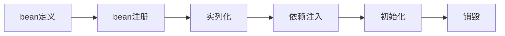

# 源码下载
[github源码](https://github.com/liangjianweiLJW/java-guide/tree/master/springboot-bean-lifecycle)


# 什么是 Spring Bean 的生命周期

对于普通的 Java 对象，当 new 的时候创建对象，然后该对象就能够使用了。一旦该对象不再被使用，则由 Java 自动进行垃圾回收。

而 Spring 中的对象是 bean，bean 和普通的 Java 对象没啥大的区别，只不过 Spring 不再自己去 new 对象了，而是由 IoC 容器去帮助我们实例化对象并且管理它，我们需要哪个对象，去问 IoC 容器要即可。IoC 其实就是解决对象之间的耦合问题，Spring Bean 的生命周期完全由容器控制。


# 重要接口介绍

Spring 容器启动后首先是读取bean的xml配置文件，然后解析xml文件中的各种bean的定义，将xml文件中的每一个<bean />元素分别转换成一个BeanDefinition对象，其中保存了从配置文件中读取到的该bean的各种信息, 读完配置文件之后，得到了很多的BeanDefinition对象，然后通过BeanDefinitionRegistry将这些bean注册到beanFactory中, 这就是Spring IOC容器启动时的基本流程.

## BeanDefinition
将Bean的定义信息存储到这个BeanDefinition相应的属性中，之后对Bean的操作就是直接对BeanDefinition进行的.

在这个接口中定义的属性有诸如类名、sccope、属性、构造函数参数列表、依赖的bean、是否单例类等.
它继承 AttributeAccessor 和 BeanMetadataElement 接口.

- AttributeAccessor接口:   定义了对属性的修改，包括获取、设置、删除。
- BeanMetadataElement：  Bean元对象持有的配置元素可以通过 getSource() 方法来获取。


BeanDefinition对应的就是\<bean>元素的配置的属性信息，列表如下:

```js
一、bean标签的属性
1）scope：**用来配置spring bean的作用域
2）singleton：**表示bean为单例的
3）abstract：设置为true，将该bean仅仅作为模板使用，应用程序上下文不会试图预先初始化它
4）lazy-init：**设为true，延迟加载，该bean不会在ApplicationContext启动时提前被实例化，而是第一次向容器通过getBean索取bean时实例化
注：只对singleton的bean起作用
5）autowire：**自动装配
6）dependency-check：依赖检查
7）depends-on：**表示一个bean的实例化依靠另一个bean先实例化
8）autowire-candidate：**设为false，容器在查找自动装配对象时，将不考虑该bean，即它不会被考虑作为其他bean自动装配的候选者，但是该bean本身可以使用自动装配来注入其他bean
9）primary：该bean优先被注入
10）init-method：**初始化bean时调用的方法
11）destory-method：**容器销毁之前所调用的方法
12）factory-method：当调用factory-method所指向的方法时，才开始实例化bean
13）factory-bean：调用静态工厂方法的方式创建bean
二、bean的子元素
1）meta：元数据，当需要使用里面的信息时可以通过key获取
2）lookup-method：获取器注入，是把一个方法声明为返回某种类型的bean但实际要返回的bean是在配置文件里面配置的
3）replaced-method：可以在运行时调用新的方法替换现有的方法，还能动态的更新原有方法的逻辑
4）constructor-arg：** 对bean自动寻找对应的构造函数，并在初始化的时候将设置的参数传入进去
5）property：** 基本数据类型赋值
6）qualifier：** 通过Qualifier指定注入bean的名称
```

```java
public interface BeanDefinition extends AttributeAccessor, BeanMetadataElement {
    String SCOPE_SINGLETON = "singleton"; //单例模式
    String SCOPE_PROTOTYPE = "prototype"; //原型模式（就是正常情况下的）
    
    //此bean的角色
    int ROLE_APPLICATION = 0; //表示这个bean是用户定义的
    int ROLE_SUPPORT = 1; //表示这个bean是第三方插件或工具的
    int ROLE_INFRASTRUCTURE = 2; //表示这个bean是spring内部自己的
    
    //设置or获取此bean的父bean的名字
    void setParentName(@Nullable String var1);
    @Nullable
    String getParentName();
    //设置or获取此bean的类名
    void setBeanClassName(@Nullable String var1);
    @Nullable
    String getBeanClassName();
    //设置or获取此bean的模式（单例模式还是原型模式）
    void setScope(@Nullable String var1);
    @Nullable
    String getScope();
    //设置or获取此bean的延迟初始化属性（true，false）
    void setLazyInit(boolean var1);
    boolean isLazyInit();
    //设置or获取依赖
    void setDependsOn(@Nullable String... var1);
    @Nullable
    String[] getDependsOn();
    //设置or获取此bean的是否接受被自动装配（true， false）
    void setAutowireCandidate(boolean var1);
    boolean isAutowireCandidate();
    //设置or获取是否是首要（true，false）
    void setPrimary(boolean var1);
    boolean isPrimary();
    //设置or获取工厂bean的名字
    void setFactoryBeanName(@Nullable String var1);
    @Nullable
    String getFactoryBeanName();
    //设置or 获取工厂bean里的生成方法名
    void setFactoryMethodName(@Nullable String var1);
    @Nullable
    String getFactoryMethodName();
    //获取构造函数的所有参数值
    ConstructorArgumentValues getConstructorArgumentValues();
    //判断构造函数参数是否为空
    default boolean hasConstructorArgumentValues() {
        return !this.getConstructorArgumentValues().isEmpty();
    }
    //获取所有的property
    MutablePropertyValues getPropertyValues();
    default boolean hasPropertyValues() {
        return !this.getPropertyValues().isEmpty();
    }
    //设置or获取初始化方法名
    void setInitMethodName(@Nullable String var1);
    @Nullable
    String getInitMethodName();
    //设置or获取销毁方法名
    void setDestroyMethodName(@Nullable String var1);
    @Nullable
    String getDestroyMethodName();
    //设置角色，就是前面的三个整数（0,1,2），用户定义、第三方的、spring内部的
    void setRole(int var1);
    int getRole();
    //设置or获取此bean的描述信息
    void setDescription(@Nullable String var1);
    @Nullable
    String getDescription();
    //判断此bean是否是单例、原型、抽象的
    boolean isSingleton();
    boolean isPrototype();
    boolean isAbstract();
    //获取资源描述，这个资源文件
    @Nullable
    String getResourceDescription();
 
    @Nullable
    BeanDefinition getOriginatingBeanDefinition();
}
```


## BeanDefinitionRegistry
定义Bean的常规操作，来注册BeanDefinition, 内部就是用一个 Map 实现.

主要功能：
- 以Map<String, BeanDefinition>的形式注册bean
- 根据beanName 删除和获取 beanDefiniation
- 得到持有的beanDefiniation的数目
- 根据beanName 判断是否包含beanDefiniation
- 它的默认实现类，主要有三个：
    - SimpleBeanDefinitionRegistry
    - DefaultListableBeanFactory
    - GenericApplicationContext


```java
public interface BeanDefinitionRegistry extends AliasRegistry {
 
	// 关键 -> 往注册表中注册一个新的 BeanDefinition 实例 
	void registerBeanDefinition(String beanName, BeanDefinition beanDefinition) throws BeanDefinitionStoreException;
	// 移除注册表中已注册的 BeanDefinition 实例
	void removeBeanDefinition(String beanName) throws NoSuchBeanDefinitionException;
	// 从注册中心取得指定的 BeanDefinition 实例
	BeanDefinition getBeanDefinition(String beanName) throws NoSuchBeanDefinitionException;
	// 判断 BeanDefinition 实例是否在注册表中（是否注册）
	boolean containsBeanDefinition(String beanName);
	
	// 取得注册表中所有 BeanDefinition 实例的 beanName（标识）
	String[] getBeanDefinitionNames();
	// 返回注册表中 BeanDefinition 实例的数量
	int getBeanDefinitionCount();
	// beanName（标识）是否被占用
	boolean isBeanNameInUse(String beanName);
}
```


- SimpleBeanDefinitionRegistry 是 BeanDefinitionRegistry 一个简单的实现，它还继承 SimpleAliasRegistry（ AliasRegistry 的简单实现），它仅仅只提供注册表功能，无工厂功能。SimpleBeanDefinitionRegistry 使用 ConcurrentHashMap 来存储注册的 BeanDefinition。

- DefaultListableBeanFactory，**它是ConfigurableListableBeanFactory（其实就是 BeanFactory ） 和 BeanDefinitionRegistry 接口的默认实现：一个基于 BeanDefinition 元数据的完整 bean 工厂**。它同样是用 ConcurrentHashMap 数据结构来存储注册的 BeanDefinition。

- GenericApplicationContext ，他实现注册、注销功能都是委托 DefaultListableBeanFactory 实现的.


所以我们只看  DefaultListableBeanFactory的核心源码:
```java
// 注册表，由 BeanDefinition 的标识 （beanName） 与其实例组成
private final Map<String, BeanDefinition> beanDefinitionMap = new ConcurrentHashMap<String, bean>(64);
 
// 标识（beanName）集合
private final List<String> beanDefinitionNames = new ArrayList<String>(64);
 
 
public void registerBeanDefinition(String beanName, BeanDefinition beanDefinition)
   throws BeanDefinitionStoreException {
 
        // 省略其他代码
 
  else {
   if (hasBeanCreationStarted()) {
    // Cannot modify startup-time collection elements anymore (for stable iteration)
    synchronized (this.beanDefinitionMap) {
     this.beanDefinitionMap.put(beanName, beanDefinition);
     List<String> updatedDefinitions = new ArrayList<>(this.beanDefinitionNames.size() + 1);
     updatedDefinitions.addAll(this.beanDefinitionNames);
     updatedDefinitions.add(beanName);
     this.beanDefinitionNames = updatedDefinitions;
     if (this.manualSingletonNames.contains(beanName)) {
      Set<String> updatedSingletons = new LinkedHashSet<>(this.manualSingletonNames);
      updatedSingletons.remove(beanName);
      this.manualSingletonNames = updatedSingletons;
     }
    }
   }
   else {
    // 注册 BeanDefinition   最重要的一句
    this.beanDefinitionMap.put(beanName, beanDefinition);
    this.beanDefinitionNames.add(beanName);
    this.manualSingletonNames.remove(beanName);
   }
   this.frozenBeanDefinitionNames = null;
  }
 
  if (existingDefinition != null || containsSingleton(beanName)) {
   resetBeanDefinition(beanName);
  }
 }
```


## BeanFactory
- 创建Bean的工厂,  它最主要的方法就是 getBean(String beanName)，该方法从容器中返回特定名称的 Bean，BeanFactory 的功能通过其他的接口得到不断扩展


BeanFactory类官方注释：

- The root interface for accessing a Spring bean container.
- This is the basic client view of a bean container; further interfaces such as ListableBeanFactory and org.springframework.beans.factory.config.ConfigurableBeanFactory are available for specific purposes.
- This interface is implemented by objects that hold a number of bean definitions, each uniquely identified by a String name. Depending on the bean definition, the factory will return either an independent instance of a contained object (the Prototype design pattern), or a single shared instance (a superior alternative to the Singleton design pattern, in which the instance is a singleton in the scope of the factory). Which type of instance will be returned depends on the bean factory configuration: the API is the same. Since Spring 2.0, further scopes are available depending on the concrete application context (e.g. "request" and "session" scopes in a web environment).
- The point of this approach is that the BeanFactory is a central registry of application components, and centralizes configuration of application components (no more do individual objects need to read properties files, for example). See chapters 4 and 11 of "Expert One-on-One J2EE Design and Development" for a discussion of the benefits of this approach.
- Note that it is generally better to rely on Dependency Injection ("push" configuration) to configure application objects through setters or constructors, rather than use any form of "pull" configuration like a BeanFactory lookup. Spring's Dependency Injection functionality is implemented using this BeanFactory interface and its subinterfaces.
- Normally a BeanFactory will load bean definitions stored in a configuration source (such as an XML document), and use the org.springframework.beans package to configure the beans. However, an implementation could simply return Java objects it creates as necessary directly in Java code. There are no constraints on how the definitions could be stored: LDAP, RDBMS, XML, properties file, etc. Implementations are encouraged to support references amongst beans (Dependency Injection).
- In contrast to the methods in ListableBeanFactory, all of the operations in this interface will also check parent factories if this is a HierarchicalBeanFactory. If a bean is not found in this factory instance, the immediate parent factory will be asked. Beans in this factory instance are supposed to override beans of the same name in any parent factory.

- Bean factory implementations should support the standard bean lifecycle interfaces as far as possible. The full set of initialization methods and their standard order is:


1. BeanNameAware's setBeanName
2. BeanClassLoaderAware's setBeanClassLoader
3. BeanFactoryAware's setBeanFactory
4. EnvironmentAware's setEnvironment
5. EmbeddedValueResolverAware's setEmbeddedValueResolver
6. ResourceLoaderAware's setResourceLoader (only applicable when running in an application context)
7. ApplicationEventPublisherAware's setApplicationEventPublisher (only applicable when running in an application context)
8. MessageSourceAware's setMessageSource (only applicable when running in an application context)
9. ApplicationContextAware's setApplicationContext (only applicable when running in an application context)
10. ServletContextAware's setServletContext (only applicable when running in a web application context)
11. postProcessBeforeInitialization methods of BeanPostProcessors
12. InitializingBean's afterPropertiesSet
13. a custom init-method definition
14. postProcessAfterInitialization methods of BeanPostProcessors

- On shutdown of a bean factory, the following lifecycle methods apply:
1. postProcessBeforeDestruction methods of DestructionAwareBeanPostProcessors
2. DisposableBean's destroy
3. a custom destroy-method definition


查看类：

- BeanNameAware.setBeanName,
- BeanClassLoaderAware.setBeanClassLoader,
- BeanFactoryAware.setBeanFactory,
- org.springframework.context.EnvironmentAware.setEnvironment,
- org.springframework.context.EmbeddedValueResolverAware.setEmbeddedValueResolver,
- org.springframework.context.ResourceLoaderAware.setResourceLoader,
- org.springframework.context.ApplicationEventPublisherAware.setApplicationEventPublisher,
- org.springframework.context.MessageSourceAware.setMessageSource,
- org.springframework.context.ApplicationContextAware.setApplicationContext,
- org.springframework.web.context.ServletContextAware.setServletContext,
- org.springframework.beans.factory.config.BeanPostProcessor.postProcessBeforeInitialization,
- InitializingBean.afterPropertiesSet,
- org.springframework.beans.factory.support.RootBeanDefinition.getInitMethodName,
- org.springframework.beans.factory.config.BeanPostProcessor.postProcessAfterInitialization,
- org.springframework.beans.factory.config.DestructionAwareBeanPostProcessor.postProcessBeforeDestruction,
- DisposableBean.destroy,
- org.springframework.beans.factory.support.RootBeanDefinition.getDestroyMethodName

```java
public interface BeanFactory {
 
    //这里是对FactoryBean的转义定义，因为如果使用bean的名字检索FactoryBean得到的对象是工厂生成的对象，
    //如果需要得到工厂本身，需要转义       
    String FACTORY_BEAN_PREFIX = "&";
 
    这里根据bean的名字，在IOC容器中得到bean实例，这个IOC容器就是一个大的抽象工厂。
 
    Object getBean(String name) throws BeansException;
 
    //这里根据bean的名字和Class类型来得到bean实例，和上面的方法不同在于它会抛出异常：如果根据名字取得的bean实例的Class类型和需要的不同的话。
    Object getBean(String name, Class requiredType) throws BeansException;
 
    //这里提供对bean的检索，看看是否在IOC容器有这个名字的bean
    boolean containsBean(String name);
 
    //这里根据bean名字得到bean实例，并同时判断这个bean是不是单件
    boolean isSingleton(String name) throws NoSuchBeanDefinitionException;
 
    //这里对得到bean实例的Class类型
    Class getType(String name) throws NoSuchBeanDefinitionException;
 
    //这里得到bean的别名，如果根据别名检索，那么其原名也会被检索出来
    String[] getAliases(String name);
 
}
```
**BeanFactory下最通用的一个实现是 DefaultListableBeanFactory,它同时也实现了BeanDefinitionRegistry接口，因此它就承担了Bean的注册管理工作。**

DefaultListableBeanFactory的类层次结构如下:


**DefaultListableBeanFactory其实要实现的功能就是以list集合的方式操作bean**，为什么要拆成这么多的类和接口呢。这里面可能基于几点考虑。

- 功能的不同维度，分不同的接口，方便以后的维护和其他人的阅读。如：AutowireCapableBeanFactory、ListableBeanFactory、HierarchicalBeanFactory等
- 不同接口的实现，分布在不同的之类里，方便以后不同接口多种实现的扩展
- 从整个类图的分布，可以看出spring在这块是面向接口编程，后面类的实现，他们认为只是接口功能实现的一种，随时可以拓展成多种实现

通过名字就大概可以了解每个接口的功能:
- HierarchicalBeanFactory接口是在继承BeanFactory的基础上，实现BeanFactory的父子关系。
- AutowireCapableBeanFactory接口是在继承BeanFactory的基础上，实现Bean的自动装配功能(`spring的自动装配原理在实现类AbstractAutowireCapableBeanFactory的doCreateBean()方法体现`)
- ListableBeanFactory接口是在继承BeanFactory的基础上，实现Bean的list集合操作功能
- ConfigurableBeanFactory接口是在继承HierarchicalBeanFactory的基础上，实现BeanFactory的全部配置管理功能，
- SingletonBeanRegistry是单例bean的注册接口
- ConfigurableListableBeanFactory接口是继承AutowireCapableBeanFactory，ListableBeanFactory，ConfigurableBeanFactory三个接口的一个综合接口
- AliasRegistry接口是别名注册接口，SimpleAliasRegistry类是简单的实现别名注册接口的类


# Bean的生命周期
Spring bean的生命周期阶段是：

- 1.bean的定义：就是从xml或注解定位资源加载读取bean的元信息并定义成一个BeanDefinition对象
- 2.bean注册： 将BeanDefinition对象根据相应的规则放到缓存池map中
- 3.实例化： 根据BeanDefinition实例化真正的bean，即是调用构造函数
- 4.依赖注入： 属性赋值调用setter方法，即是依赖注入（DI）
- 5.初始化: 初始化是用户能自定义扩展的阶段
- 6.销毁: 销毁是用户能自定义扩展的阶段


注：其他都是在这阶段前后的扩展点

1. [Spring和Springboot角度查看bean定义和注册](url)

2. AbstractAutowireCapableBeanFactory为AutowireCapableBeanFactory接口的一个实现类，其中AbstractAutowireCapableBeanFactory实现类的一个方法doCreateBean()


```java
//位置：AbstractAutowireCapableBeanFactory#doCreateBean
protected Object doCreateBean(String beanName, RootBeanDefinition mbd, @Nullable Object[] args) throws BeanCreationException {
    BeanWrapper instanceWrapper = null;
    if (mbd.isSingleton()) {
        instanceWrapper = (BeanWrapper)this.factoryBeanInstanceCache.remove(beanName);
    }

    if (instanceWrapper == null) {
    	// 实例化阶段
        instanceWrapper = this.createBeanInstance(beanName, mbd, args);
    }

    ...

    Object exposedObject = bean;

    try {
    	// 属性赋值阶段
        this.populateBean(beanName, mbd, instanceWrapper);
        // 初始化阶段
        exposedObject = this.initializeBean(beanName, exposedObject, mbd);
    } catch (Throwable var18) {
        ...
    }

    ...
}
```

可以发现，分别调用三种方法：
1. createBeanInstance() -> 实例化
2. populateBean() -> 属性赋值
3. initializeBean() -> 初始化

而销毁阶段是在容器关闭时调用的，在ConfigurableApplicationContext#close()

至于xxxAware，BeanPostProcessor，BeanFactoryPostProcessor等类，只不过是对主流程四个步骤的一系列扩展点而已。


# Bean的生命周期的扩展点
Spring Bean 的生命周期的扩展点很多，这里不可能全部列出来，只说核心的扩展点。这也就是为什么 Spring 的扩展性很好的原因，开了很多的口子，尽可能让某个功能高内聚松耦合，用户需要哪个功能就用哪个，而不是直接来一个大而全的东西。

## Bean级别
这些接口的实现类是基于 Bean 的，**只要实现了这些接口的Bean才起作用**。

- BeanNameAware
- BeanFactoryAware
- ApplicationContextAware
- InitializingBean
- DisposableBean

还要很多的xxxAware，这些不常用，下面生命周期测试就不加上，如：
- BeanClassLoaderAware
- EnvironmentAware
- EmbeddedValueResolverAware
- ResourceLoaderAware
- ApplicationEventPublisherAware
- MessageSourceAware
- ServletContextAware

## 容器级别
这些接口的实现类是独立于 Bean 的，并且会注册到 Spring 容器中。一般称它们的实现类为`后置处理器`。**在 Spring 容器创建任何 Bean 的时候，这些后置处理器都会发生作用**

- BeanPostProcessor
- InstantiationAwareBeanPostProcessor（InstantiationAwareBeanPostProcessor 是继承了 BeanPostProcessor）
- 工厂后处理器接口也是容器级的。在应用上下文装配配置文件之后立即调用：
    - AspectJWeavingEnabler
    - ConfigurationClassPostProcessor
    - CustomAutowireConfigurer


# 常用接口

## InstantiationAwareBeanPostProcessor

- 该类是 BeanPostProcessor 的子接口，常用的有如下三个方法：
    - postProcessBeforeInstantiation(Class beanClass, String beanName)：在bean实例化之前调用
    - postProcessProperties(PropertyValues pvs, Object bean, String beanName)：在bean实例化之后、设置属性前调用
    - postProcessAfterInstantiation(Class beanClass, String beanName)：在bean实例化之后调用

## BeanNameAware
- BeanNameAware接口是为了让自身Bean能够感知到，只有一个方法setBeanName(String name)，**获取到自身在Spring容器中的id或name属性。**

## BeanFactoryAware
- 该接口只有一个方法setBeanFactory(BeanFactory beanFactory)，**用来获取当前环境中的 BeanFactory，可以对工厂中的所有bean进行扩展。**

## ApplicationContextAware
- 该接口只有一个方法setApplicationContext(ApplicationContext applicationContext)，**用来获取当前环境中的 ApplicationContext，可以对整个容器进行扩展。**

- 注：有时候并不会调用该接口，这要根据你的IOC容器来决定：Spring IOC容器最低要求是实现BeanFactory接口，而不是实现ApplicationContext接口，对于那些没有实现ApplicationContext接口的容器，在生命周期对应的ApplicationContextAware定义的方法也是不会调用的，只要实现了ApplicationContext接口的容器，才会调用。

## BeanPostProcessor
- postProcessBeforeInitialization(Object bean, String beanName)：在初始化之前调用此方法，Spring 的 AOP 就是利用它实现的。
- postProcessAfterInitialization(Object bean, String beanName)：在初始化之后调用此方法


## InitializingBean
- 该接口只有一个方法afterPropertiesSet()，**在属性注入完成后调用**。
- 凡是继承该接口的类，在初始化bean的时候都会执行该方法，可以进行一些属性配置等工作。
-  InitializingBean 对应生命周期的初始化阶段，在源码的invokeInitMethods(beanName, wrappedBean, mbd)方法中调用。

## DisposableBean
- 该接口的作用是在对象销毁时调用，可以做一些资源销毁操作。
- DisposableBean 类似于InitializingBean，对应生命周期的销毁阶段，以ConfigurableApplicationContext#close()方法作为入口，实现是通过循环取所有实现了DisposableBean接口的Bean然后调用其destroy()方法


# 常用注解

## @Bean(initMethod = "initMethod", destroyMethod = "destroyMethod")
- @Bean声明一个bean,配合@Configuration注解使用
- initMethod：声明bean初始化时回调一个方法，该方法需要程序员编写
- destroyMethod：声明bean销毁时回调一个方法，该方法需要程序员编写

## @PostConstruct
- bean的一个基于注解的初始化方法

## @PreDestroy
- bean的一个基于注解的销毁方法


# 案例分析
## 声明一个bean
```java
@Configuration
public class BeanInitAndDestroyConfig {

    /**
     * @return 这里没有指定bean名字，默认是方法名
     */
    @Description("测试bean的生命周期")
    @Bean(initMethod = "initMethod", destroyMethod = "destroyMethod")
    public MyService myServiceBeanName() {//入参数可注入其他依赖
        return new MyService();
    }
}
```
- 声明一个名为：myServiceBeanName的bean
- initMethod：bean的初始化方法为：initMethod
- destroyMethod：bean的销毁方法为：destroyMethod


## Animal实现类

- 这里只是想用来说明 @Qualifier注解能根据bean名称匹配。


## 我的服务类
- 即是针对当前bean`只调用一次`的接口

```java
/**
 * @Description: bean生命周期测试：这些接口只针对当前bean
 * @Author: jianweil
 * @date: 2021/12/8 9:46
 */
public class MyService implements Person, BeanNameAware, BeanFactoryAware, ApplicationContextAware, InitializingBean, DisposableBean {

    private Animal animal = null;

    private ApplicationContext applicationContext;

    /**
     *接口规定方法
     */
    @Override
    public void service() {
        this.animal.use();
    }

    public MyService() {
        System.out.println("2. [bean实例化]："+this.getClass().getSimpleName()+"----------构造方法");
    }
    /**
     *接口规定方法：注入依赖
     */
    @Override
    @Autowired
    @Qualifier("dog")
    public void setAnimal(Animal animal) {
        System.out.println("5. [bean属性赋值]：dog----依赖注入");
        this.animal = animal;
    }


    @Override
    public void setBeanName(String s) {
        System.out.println("6. 调用【BeanNameAware】--setBeanName:"+s);

    }

    @Override
    public void setBeanFactory(BeanFactory beanFactory) throws BeansException {
        System.out.println("7. 调用【BeanFactoryAware】--setBeanFactory");
    }


    @Override
    public void setApplicationContext(ApplicationContext applicationContext) throws BeansException {
        this.applicationContext = applicationContext;
        System.out.println("8. 调用【ApplicationContextAware】--setApplicationContext");

    }

    /**
     * 初始化1
     */
    @PostConstruct
    public void myInit() {
        System.out.println("10. [初始化] 注解@PostConstruct自定义初始化方法[myInit]");
    }

    /**
     * 初始化2
     */
    @Override
    public void afterPropertiesSet() throws Exception {
        System.out.println("11. [初始化] 接口InitializingBean方法[afterPropertiesSet]");

    }

    /**
     * 初始化3
     */
    public void initMethod() {
        System.out.println("12. [初始化] 注解@Bean自定义初始化方法[initMethod]");
    }

    /**
     * 销毁1
     */
    @PreDestroy
    public void myDestroy() {
        System.out.println("14. [销毁] 注解@PreDestroy自定义销毁方法[myDestroy]");
    }

    /**
     * 销毁2
     */
    @Override
    public void destroy() throws Exception {
        System.out.println("15. [销毁] 接口DisposableBean方法[destroy]");
    }

    /**
     * 销毁3
     */
    public void destroyMethod() {
        System.out.println("16. [销毁] 注解@Bean自定义销毁方法[destroyMethod]");
    }
}
```

- 这里实现的接口只作用于当前bean（即是上面@bean定义的bean名为myDefineBeanName）生命周期


## 后置处理器
- `每个bean生命周期都执行一次`
- 后置处理器是作用于ioc容器中所有bean的生命周期。


```java
/**
 * @Description: todo
 * @Author: jianweil
 * @date: 2021/12/20 17:20
 */
@Component
public class MyInstantiationAwareBeanPostProcessor implements InstantiationAwareBeanPostProcessor {
    @Override
    public Object postProcessBeforeInstantiation(Class<?> beanClass, String beanName) throws BeansException {
        if ("myServiceBeanName".equals(beanName) || "dog".equals(beanName)) {
            System.out.println("============================InstantiationAwareBeanPostProcessor-开始======================");
            System.out.println("1. [容器级别每个bean都回调] 调用 InstantiationAwareBeanPostProcessor.postProcessBeforeInstantiation() 方法：beanName为"+beanName);
        }
        return null;
    }

    @Override
    public boolean postProcessAfterInstantiation(Object bean, String beanName) throws BeansException {
        if ("myServiceBeanName".equals(beanName) || "dog".equals(beanName)) {
            System.out.println("3. [容器级别每个bean都回调] 调用 InstantiationAwareBeanPostProcessor.postProcessAfterInstantiation() 方法：beanName为"+beanName);
        }
        return true;
    }

    @Override
    public PropertyValues postProcessProperties(PropertyValues pvs, Object bean, String beanName) throws BeansException {
        if ("myServiceBeanName".equals(beanName) || "dog".equals(beanName)) {
            System.out.println("4. [容器级别每个bean都回调] 调用 InstantiationAwareBeanPostProcessor.postProcessProperties() 方法：beanName为"+beanName);
            System.out.println("============================InstantiationAwareBeanPostProcessor-结束======================");

        }
        return null;
    }
}
```

```java
/**
 * @Description: 后置bean的初始化器：所有的bean都会拦截执行
 * @Author: jianweil
 * @date: 2021/12/8 9:46
 */
@Component
public class MyBeanPostProcessor implements BeanPostProcessor {
    @Override
    public Object postProcessBeforeInitialization(Object bean, String beanName) throws BeansException {
        //这里过滤掉springboot自动配置的bean，只打印我们项目的bean情况
        if ("myServiceBeanName".equals(beanName) || "dog".equals(beanName)) {
            System.out.println("9. [容器级别每个bean都回调] 调用 BeanPostProcessor.postProcessBeforeInitialization 方法：beanName为" + beanName);
        }

        return bean;
    }

    @Override
    public Object postProcessAfterInitialization(Object bean, String beanName) throws BeansException {
        if ("myServiceBeanName".equals(beanName) || "dog".equals(beanName)) {
            System.out.println("13. [容器级别每个bean都回调] 调用 BeanPostProcessor.postProcessAfterInitialization 方法：beanName为" + beanName);
        }
        return bean;
    }
}
```


## 工厂后置处理器
- 容器级别，只允许一次
```java
@Component
public class MyBeanFactoryPostProcessor implements BeanFactoryPostProcessor {
    @Override
    public void postProcessBeanFactory(ConfigurableListableBeanFactory beanFactory) throws BeansException {
        System.out.println("0. [容器级别只调用一次] 调用 BeanFactoryPostProcessor.postProcessBeanFactory() 方法");
    }
}
```

## 输出结果和结果解读
- “//”标记为解读

```java
//容器级别的工厂后置处理器，只在应用上下文装配配置文件之后立即调用1次
0. [容器级别只调用一次] 调用 BeanFactoryPostProcessor.postProcessBeanFactory() 方法


//因为我们生命过程只打印("myServiceBeanName".equals(beanName) || "dog".equals(beanName))，所有猫只有构造方法打印了
猫----------构造方法

//###############################dog的生命周期###############################################
//后置处理器，容器级别，作用于所有bean
============================InstantiationAwareBeanPostProcessor-开始======================
1. [容器级别每个bean都回调] 调用 InstantiationAwareBeanPostProcessor.postProcessBeforeInstantiation() 方法：beanName为dog
//狗的实例化
狗----------构造方法
//后置处理器，容器级别，作用于所有bean
3. [容器级别每个bean都回调] 调用 InstantiationAwareBeanPostProcessor.postProcessAfterInstantiation() 方法：beanName为dog
//后置处理器，容器级别，作用于所有bean
4. [容器级别每个bean都回调] 调用 InstantiationAwareBeanPostProcessor.postProcessProperties() 方法：beanName为dog
============================InstantiationAwareBeanPostProcessor-结束======================
//后置处理器，容器级别，作用于所有bean
9. [容器级别每个bean都回调] 调用 BeanPostProcessor.postProcessBeforeInitialization 方法：beanName为dog
//后置处理器，容器级别，作用于所有bean
13. [容器级别每个bean都回调] 调用 BeanPostProcessor.postProcessAfterInitialization 方法：beanName为dog
//###############################dog的bean完成,开始myServiceBeanName###############################################


//后置处理器，容器级别，作用于所有bean
============================InstantiationAwareBeanPostProcessor-开始======================
1. [容器级别每个bean都回调] 调用 InstantiationAwareBeanPostProcessor.postProcessBeforeInstantiation() 方法：beanName为myServiceBeanName

//实例化
2. [bean实例化]：MyService----------构造方法

//后置处理器，容器级别，作用于所有bean
3. [容器级别每个bean都回调] 调用 InstantiationAwareBeanPostProcessor.postProcessAfterInstantiation() 方法：beanName为myServiceBeanName
//后置处理器，容器级别，作用于所有bean
4. [容器级别每个bean都回调] 调用 InstantiationAwareBeanPostProcessor.postProcessProperties() 方法：beanName为myServiceBeanName
============================InstantiationAwareBeanPostProcessor-结束======================

//属性赋值，即是依赖注入
5. [bean属性赋值]：dog----依赖注入

//bean级别，bean：myServiceBeanName实现了接口BeanNameAware
6. 调用【BeanNameAware】--setBeanName:myServiceBeanName
//bean级别
7. 调用【BeanFactoryAware】--setBeanFactory
//bean级别
8. 调用【ApplicationContextAware】--setApplicationContext

//后置处理器，容器级别，作用于所有bean：初始化前处理
9. [容器级别每个bean都回调] 调用 BeanPostProcessor.postProcessBeforeInitialization 方法：beanName为myServiceBeanName

//初始化
10. [初始化] 注解@PostConstruct自定义初始化方法[myInit]
11. [初始化] 接口InitializingBean方法[afterPropertiesSet]
12. [初始化] 注解@Bean自定义初始化方法[initMethod]

//后置处理器，容器级别，作用于所有bean：初始化后处理
13. [容器级别每个bean都回调] 调用 BeanPostProcessor.postProcessAfterInitialization 方法：beanName为myServiceBeanName

//容器环境加载完成，这时可以使用所有bean
2021-12-21 11:18:42.994  INFO 18956 --- [           main] c.l.s.SpringbootBeanLifecycleApplication : Started SpringbootBeanLifecycleApplication in 0.719 seconds (JVM running for 1.312)

//销毁
14. [销毁] 注解@PreDestroy自定义销毁方法[myDestroy]
15. [销毁] 接口DisposableBean方法[destroy]
16. [销毁] 注解@Bean自定义销毁方法[destroyMethod]

Process finished with exit code 0

```

# Bean 生命周期图


了解 Spring 生命周期的意义就在于，可以利用 Bean 在其存活期间的指定时刻完成一些相关操作。一般情况下，会在 Bean 被初始化后和被销毁前执行一些相关操作。


- 👍🏻：有收获的，点赞鼓励！
- ❤️：收藏文章，方便回看！
- 💬：评论交流，互相进步！
